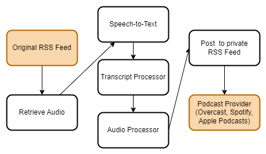

A simple tool for removing ads from podcasts.



## Installation

```bash
pip install -r requirements.txt
```

## Usage

## Notes

I originally planned to use Azure Cognitive Services to transcribe the podcast audio, at least for simplicity while testing. The free tier only allows 5 hours of audio per month, so I'd fly through that really quickly if I were to use this tool regularly.

However, it doesn't appear as though Azure actually provides a convenient way to _align_ its speech-to-text outputs with audio. That seems like a major oversight—there are lots of non-neural forced alignment tools out there—but [Buzz](https://chidiwilliams.github.io/buzz/docs) actually provides a great solution, which calls on OpenAI's Whisper model (which was actually open-sourced). Since I can run that locally (albeit somewhat slowly) from a very straightforward CLI, I think I'll use that instead.

The main problem with Buzz at the moment is _closing_ it from the CLI. It seems to hang indefinitely, and I have to kill the process manually. I'll have to look into that.

I don't think the Buzz source code is particularly inscrutable, though - if anything, it's quite accessible. I think
that if I look at it a bit more closely, I should be able to figure out how to use it in a more programmatic way.

Also, I think I should use a zer-shot classifier for ads. There are a couple on HuggingFace including one from 2022, `morenolq/spotify-podcast-advertising-classification`, which might be worth checking out.

I ran the following as an administrator to get the daily task scheduled:

```powershell
$Action = New-ScheduledTaskAction -Execute "c:\Users\bkweb\projects\skipcastify\scripts\run_pipeline.bat"
$Trigger = New-ScheduledTaskTrigger -Daily -At 4am
Register-ScheduledTask -Action $Action -Trigger $Trigger -TaskName "Skipcastify Pipeline" -Description "Run Skipcastify pipeline daily"
```

### Pipeline

1. Download new podcast episodes
2. Transcribe with Whisper (local, ~1-2x real-time)
3. Classify segments (content vs ads vs intros/outros)
4. Aggregate consecutive segments of same type
5. Cut and stitch audio (remove non-content segments)
6. Save ad-free audio to `data/podcasts/processed/`
7. Update podcast feed with new audio files
