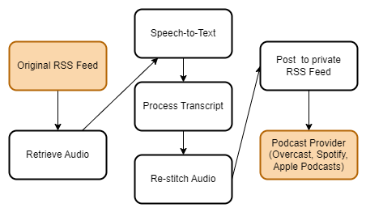

A simple tool for removing ads from podcasts.



## Installation
```bash
pip install -r requirements.txt
```

## Usage


## Notes
I originally planned to use Azure Cognitive Services to transcribe the podcast audio, at least for simplicity while testing. The free tier only allows 5 hours of audio per month, so I'd fly through that really quickly if I were to use this tool regularly.

However, it doesn't appear as though Azure actually provides a convenient way to *align* its speech-to-text outputs with audio. That seems like a major oversight—there are lots of non-neural forced alignment tools out there—but [Buzz](https://chidiwilliams.github.io/buzz/docs) actually provides a great solution, which calls on OpenAI's Whisper model (which was actually open-sourced). Since I can run that locally (albeit somewhat slowly) from a very straightforward CLI, I think I'll use that instead.

Overall process
- Every time a new podcast episode is released, download it 